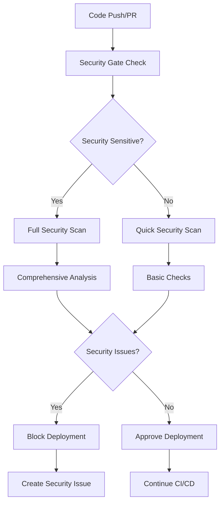

# Security Implementation Guide

## Overview

This document provides a comprehensive overview of the security scanning and monitoring infrastructure implemented for Lightning DB. The security system is designed to follow enterprise security standards and provides multiple layers of protection.

## Security Architecture

### 1. Multi-Layer Security Scanning

```
┌─────────────────┐    ┌─────────────────┐    ┌─────────────────┐
│   Source Code   │    │   Dependencies  │    │   Containers    │
│    Security     │    │    Security     │    │    Security     │
└─────────────────┘    └─────────────────┘    └─────────────────┘
         │                       │                       │
         ▼                       ▼                       ▼
┌─────────────────────────────────────────────────────────────────┐
│                    Security Reporting                          │
└─────────────────────────────────────────────────────────────────┘
         │
         ▼
┌─────────────────────────────────────────────────────────────────┐
│              CI/CD Security Integration                         │
└─────────────────────────────────────────────────────────────────┘
```

### 2. GitHub Actions Workflows

The security implementation consists of 6 main workflows:

| Workflow | Purpose | Frequency | Integration |
|----------|---------|-----------|-------------|
| `security-audit.yml` | Core security scanning | Daily + PR/Push | Always runs |
| `sast-analysis.yml` | Static Application Security Testing | Weekly + PR/Push | Triggered by changes |
| `dependency-security.yml` | Dependency vulnerability scanning | Daily + dependency changes | High priority |
| `container-security.yml` | Container and Docker security | Weekly + Docker changes | Build integration |
| `secrets-security.yml` | Secret detection and prevention | Daily + PR/Push | Pre-commit integration |
| `security-reporting.yml` | Centralized security reporting | Weekly + workflow completion | Management reporting |

## Security Tools Matrix

### Static Analysis Security Testing (SAST)

| Tool | Purpose | Coverage | Risk Level |
|------|---------|----------|------------|
| **Semgrep** | Pattern-based SAST | OWASP Top 10, CWE Top 25 | High |
| **CodeQL** | Semantic code analysis | Complex vulnerabilities | High |
| **Cargo Clippy** | Rust-specific security lints | Language-specific issues | Medium |
| **Cargo Geiger** | Unsafe code detection | Memory safety | High |

### Dependency Security

| Tool | Purpose | Coverage | Risk Level |
|------|---------|----------|------------|
| **cargo-audit** | Known vulnerability detection | RustSec database | High |
| **cargo-deny** | License & supply chain | Compliance & bans | Medium |
| **Dependabot** | Automated updates | GitHub Advisory DB | Medium |
| **cargo-outdated** | Update recommendations | Version tracking | Low |

### Secret Detection

| Tool | Purpose | Coverage | Risk Level |
|------|---------|----------|------------|
| **detect-secrets** | Baseline secret scanning | Comprehensive patterns | High |
| **TruffleHog** | Git history scanning | Historical exposure | High |
| **GitLeaks** | Git-native secret detection | Repository scanning | High |
| **Semgrep Secrets** | Pattern-based secrets | Custom rule sets | Medium |

### Container Security

| Tool | Purpose | Coverage | Risk Level |
|------|---------|----------|------------|
| **Trivy** | Container vulnerability scanning | CVE database | High |
| **Snyk** | Container security testing | Commercial database | High |
| **Hadolint** | Dockerfile linting | Best practices | Medium |
| **Docker Bench** | CIS compliance | Security benchmarks | Medium |

## Security Configuration

### 1. Cargo Deny Configuration (`deny.toml`)

- **Advisories**: Deny vulnerabilities, warn on unmaintained packages
- **Licenses**: Allow permissive licenses, deny strong copyleft
- **Bans**: Manage duplicate dependencies and problematic crates
- **Sources**: Restrict to official crates.io registry

### 2. Pre-commit Hooks (`.pre-commit-config.yaml`)

- **Security**: cargo-audit, cargo-deny, detect-secrets, semgrep
- **Quality**: clippy with security lints, format checking
- **Git**: Large file detection, merge conflict detection
- **Docker**: Hadolint for Dockerfile security

### 3. Dependabot Configuration (`.github/dependabot.yml`)

- **Cargo Dependencies**: Weekly updates with security priority
- **GitHub Actions**: Weekly action updates
- **Docker Images**: Weekly base image updates
- **Review Process**: Automatic security team assignment

## Security Gates and Integration

### 1. CI/CD Integration Flow



### 2. Risk Assessment Matrix

| Risk Level | Criteria | Actions |
|------------|----------|---------|
| **HIGH** | Critical vulnerabilities, active exploits | Block deployment, immediate fix |
| **MEDIUM** | Important vulnerabilities, compliance issues | Fix within 48 hours |
| **LOW** | Minor issues, outdated dependencies | Fix within 1 week |

### 3. Security Reporting

- **Daily**: Automated vulnerability scanning
- **Weekly**: Comprehensive security reports
- **On-Demand**: Manual security assessments
- **Incident**: Immediate alerting and response

## Implementation Details

### 1. Workflow Triggers

```yaml
# Comprehensive security scanning
on:
  push:
    branches: [ main, master, develop ]
  pull_request:
    branches: [ main, master ]
  schedule:
    - cron: '0 6 * * *'  # Daily at 6 AM UTC
  workflow_dispatch:
```

### 2. Security Permissions

```yaml
permissions:
  contents: read          # Read repository contents
  security-events: write  # Upload SARIF reports
  pull-requests: write    # Comment on PRs
  issues: write          # Create security issues
```

### 3. Artifact Management

- **Retention**: Security reports kept for 90 days
- **Artifacts**: SARIF files, scan results, compliance reports
- **Distribution**: GitHub Security tab, workflow summaries

## Security Metrics and KPIs

### 1. Security Posture Metrics

- **Vulnerability Count**: Total active vulnerabilities
- **Mean Time to Fix**: Average time to resolve security issues
- **Security Coverage**: Percentage of codebase scanned
- **Compliance Score**: Adherence to security policies

### 2. Process Metrics

- **Scan Frequency**: Number of scans per week
- **False Positive Rate**: Percentage of false security alerts
- **Tool Effectiveness**: Vulnerabilities found per tool
- **Response Time**: Time from detection to acknowledgment

### 3. Compliance Tracking

- **OWASP Top 10**: Coverage and mitigation status
- **CIS Controls**: Implementation status
- **Industry Standards**: SOC 2, ISO 27001 alignment
- **Regulatory**: GDPR, HIPAA compliance where applicable

## Security Incident Response

### 1. Detection and Alerting

- **Automated**: Security workflows create GitHub issues
- **Notifications**: Slack/email alerts for high-risk findings
- **Escalation**: Security team automatic assignment
- **Tracking**: Issue templates for consistent response

### 2. Response Procedures

1. **Immediate** (0-4 hours): Acknowledge and assess
2. **Short-term** (4-24 hours): Contain and investigate
3. **Medium-term** (1-7 days): Fix and validate
4. **Long-term** (1-4 weeks): Review and improve

### 3. Communication Plan

- **Internal**: Security team, development team, management
- **External**: Security researchers, customers (if applicable)
- **Documentation**: Incident reports, lessons learned
- **Improvement**: Process updates based on incidents

## Continuous Improvement

### 1. Regular Reviews

- **Monthly**: Security tool effectiveness review
- **Quarterly**: Security policy updates
- **Annually**: Comprehensive security assessment
- **Ad-hoc**: After security incidents or major changes

### 2. Tool Updates

- **Automated**: Dependabot for GitHub Actions updates
- **Manual**: Regular review of new security tools
- **Testing**: Validation of new security rules and policies
- **Integration**: Seamless addition of new security capabilities

### 3. Training and Awareness

- **Onboarding**: Security training for new team members
- **Regular**: Monthly security awareness sessions
- **Incident**: Post-incident security training
- **Industry**: Conference attendance and knowledge sharing

## Getting Started

### For Developers

1. **Install pre-commit hooks**:
   ```bash
   pip install pre-commit
   pre-commit install
   ```

2. **Run local security checks**:
   ```bash
   cargo audit
   cargo deny check
   detect-secrets scan --all-files
   ```

3. **Review security documentation**:
   - Read `SECURITY.md` for reporting procedures
   - Follow secure coding guidelines
   - Understand the CI/CD security gates

### For Security Team

1. **Configure notifications**:
   - Set up Slack webhook URL
   - Configure email notifications
   - Review GitHub security settings

2. **Customize security policies**:
   - Update `deny.toml` for project needs
   - Modify security workflow thresholds
   - Add project-specific security rules

3. **Monitor security metrics**:
   - Review weekly security reports
   - Track security KPIs
   - Investigate security trends

### For Operations

1. **Production security**:
   - Enable all security features
   - Configure runtime security monitoring
   - Implement security logging

2. **Deployment security**:
   - Use signed container images
   - Implement security scanning in deployment pipeline
   - Configure network security policies

3. **Monitoring and response**:
   - Set up security alerting
   - Configure incident response procedures
   - Regular security assessments

## Support and Resources

- **Documentation**: See `docs/` directory for detailed guides
- **Security Team**: Contact security@company.com
- **Issues**: Use GitHub issues with `security` label
- **Updates**: Follow security announcements and advisories

## Conclusion

This security implementation provides comprehensive, enterprise-grade security scanning and monitoring for Lightning DB. The multi-layered approach ensures early detection of security issues while maintaining development velocity through intelligent automation and risk-based decisioning.

The system is designed to be:
- **Comprehensive**: Multiple tools covering all attack vectors
- **Automated**: Minimal manual intervention required
- **Integrated**: Seamless CI/CD pipeline integration
- **Scalable**: Can grow with project complexity
- **Maintainable**: Clear documentation and processes

Regular reviews and updates ensure the security system remains effective against evolving threats while supporting the project's security and compliance goals.